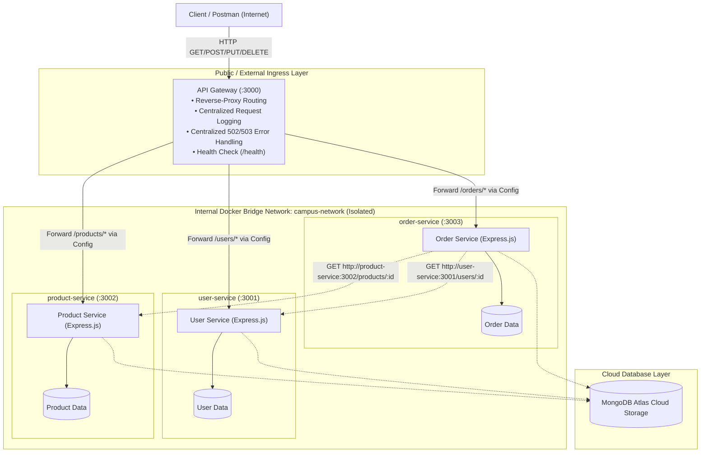

# Lab 7 – API Gateway, Configuration-Based Service Discovery & Cloud Deployment

**Course:** Web Services & SOA Laboratory • Lab 7  
**Student Roll Number:** 202512039  
**Application:** CampusConnect Microservices Backend  
**Deployment Stack:** Node.js, Express, Docker Compose, Docker Bridge Network, Render / Railway Cloud  

---

## 1. Executive Summary & Objective

In **Lab 6**, the CampusConnect backend was decomposed into three independently runnable, containerized microservices:
1. **User Service** (port 3001)
2. **Product Service** (port 3002)
3. **Order Service** (port 3003)

In that architecture, each microservice exposed its port directly to the host, forcing clients to know internal ports and hostnames, while the API Gateway existed only as an abstract design concept.

**Lab 7 turns that concept into reality:**
1. **Part A – Build a Real API Gateway:** Developed a dedicated `api-gateway` service using Express.js and `http-proxy-middleware` acting as the single reverse-proxy entry point. Only the API Gateway's port (`:3000`) is exposed externally in `docker-compose.yml`. Downstream microservices (`user-service`, `product-service`, `order-service`) are fully isolated inside the Docker bridge network (`campus-network`).
2. **Part B – Configuration-Based Service Discovery:** Externalized all upstream service endpoints into environment variables (`USER_SERVICE_URL`, `PRODUCT_SERVICE_URL`, `ORDER_SERVICE_URL`). The gateway reads this configuration dynamically at startup to populate its routing table, eliminating hard-coded URLs and enabling dynamic redirection without touching application source code.
3. **Part C – Cloud Deployment:** Packaged and configured the containerized multi-service architecture for public cloud hosting (using Render / Railway Blueprint IaC `render.yaml`), establishing an internet-accessible gateway endpoint connected to downstream services and cloud-hosted database storage.

```
Full-Stack Flow:
Client / Postman (Internet)
       │
       ▼
API Gateway (Public, Cloud-Hosted / Port 3000)
       │ (Configuration-Based Service Discovery)
       ├──► /users/*    ──► User Service    (Internal Container :3001)
       ├──► /products/* ──► Product Service (Internal Container :3002)
       └──► /orders/*   ──► Order Service   (Internal Container :3003)
                                 │
                                 └──► MongoDB Atlas / Isolated Datastores
```

---

## 2. Architecture & Layering

### Layered Architecture Diagram



### Layer Responsibilities & Network Reachability

| Layer | Responsibility | Reachable From |
|---|---|---|
| **Client / Postman** | Initiates requests to a single, unified public address. | Internet |
| **API Gateway** | Reverse proxies `/users`, `/products`, `/orders`; performs request logging, dynamic routing, and centralized 502/503 error handling. | Internet (Public: Port 3000 or Cloud URL) |
| **User Service** | User identity, authentication, profile management, and role validation. | **Docker network only** (Internal port 3001) |
| **Product Service** | Product catalog, pricing, item details, and stock inventory. | **Docker network only** (Internal port 3002) |
| **Order Service** | Purchase transaction lifecycle, cross-service validation against User and Product services. | **Docker network only** (Internal port 3003) |
| **MongoDB Atlas** | Persistent storage per domain model. | Services (via connection string) |

---

## 3. Gateway Endpoints & Routing Table

The API Gateway routes client requests based on path prefixes without embedding business logic:

| Gateway Path | Routed To | Target Microservice | Example Request |
|---|---|---|---|
| `GET /health` | Gateway itself | *None (Native endpoint)* | `GET http://localhost:3000/health` |
| `GET /` | Gateway itself | *None (Overview endpoint)* | `GET http://localhost:3000/` |
| `GET /users`, `GET /users/:id` | User Service | `http://user-service:3001` | `GET http://localhost:3000/users/101` |
| `POST /users`, `PUT /users/:id`, `DELETE /users/:id` | User Service | `http://user-service:3001` | `POST http://localhost:3000/users` |
| `GET /products`, `GET /products/:id` | Product Service | `http://product-service:3002` | `GET http://localhost:3000/products/501` |
| `POST /products`, `PUT /products/:id`, `DELETE /products/:id` | Product Service | `http://product-service:3002` | `POST http://localhost:3000/products` |
| `GET /orders`, `GET /orders/:id` | Order Service | `http://order-service:3003` | `GET http://localhost:3000/orders/ord-1001` |
| `POST /orders` | Order Service | `http://order-service:3003` | `POST http://localhost:3000/orders` |

---

## 4. Discussion Question Answers

### Part A Discussion: Why introduce an API Gateway instead of letting clients call each service directly?

Introducing an API Gateway as the single entry point provides essential architectural advantages over direct client-to-service communication:

1. **Single Entry Point & Encapsulation:** Clients interact with a single predictable hostname (`http://api.campus.edu` or port 3000) rather than tracking dozens of disparate IP addresses and port numbers (`:3001`, `:3002`, `:3003`).
2. **Hiding Internal Topography & Security Hardening:** In Lab 6, all microservices had open public ports, creating multiple attack vectors and exposing the internal microservice topology. With an API Gateway, only port 3000 is open. Downstream services live in a private Docker network (`campus-network`) completely unreachable from the outside internet. Internal refactoring, renaming, or migrating services does not break client contracts.
3. **Centralizing Cross-Cutting Concerns:**
   - **Centralized Logging & Distributed Tracing:** Request method, path, target service, status codes, and latency are logged in a single place with correlation headers (`X-Gateway-Request-Id`).
   - **Centralized Resilience & Error Handling:** When downstream services crash, restart, or timeout, the gateway intercepts the socket error (`ECONNREFUSED`, `ENOTFOUND`, `ETIMEDOUT`) and returns a standardized HTTP `502 Bad Gateway` or `503 Service Unavailable` JSON response, preventing client hangs and connection leaks.
   - **Authentication, Rate Limiting, and CORS:** Security policies, SSL termination, and token verification can be enforced once at the perimeter instead of re-implementing them redundantly across every microservice.

---

### Part B Discussion: Static / Config-Based Service Discovery vs. Dynamic Service Discovery

| Dimension | Static / Config-Based Discovery (This Lab) | Dynamic Service Discovery (Consul, Eureka, K8s DNS) |
|---|---|---|
| **Mechanism** | Environment variables (`USER_SERVICE_URL`) or static config files loaded at process startup. | Dynamic service registry with self-registration, heartbeats, and continuous health probes. |
| **Handling Dynamic Scaling** | Cannot handle dynamic auto-scaling. Adding instance replicas requires reconfiguring env vars and restarting the gateway. | Fully automatic. New container instances register themselves on launch and are automatically added to the routing pool. |
| **Load Balancing** | Direct 1-to-1 mapping or external load balancer required. | Client-side or server-side load balancing (Round-robin, least connections, weighted). |
| **Health Checking & Eviction** | Gateway attempts request; if service is down, it catches error reactively (502/503). | Proactive active health checks. Unhealthy nodes are automatically deregistered and evicted before traffic is routed to them. |
| **Operational Complexity** | Extremely lightweight, simple to understand, zero external dependencies. | Requires running and maintaining a distributed consensus cluster (e.g., Raft/Paxos in Consul/etcd). |

**What a dynamic registry adds that a static config file cannot:**  
A dynamic service registry (such as HashiCorp Consul, Netflix Eureka, or Kubernetes CoreDNS/etcd) provides **self-registration, ephemeral IP tracking, automated traffic shifting, and proactive health monitoring**. In modern cloud-native environments where containers are spun up and torn down rapidly across autoscaling groups, IP addresses are volatile and ephemeral. Dynamic service discovery allows instances to announce their arrival, register their dynamically assigned IP/port, emit heartbeats, and be automatically removed from rotation upon failure without requiring manual configuration updates or gateway reboots.

---

## 5. Implementation Details

### 5.1 API Gateway Implementation (`api-gateway/server.js`)
- Uses `express`, `cors`, and `http-proxy-middleware` v3.
- Mounts reverse-proxy routes dynamically from `config.services`.
- Fixes POST/PUT body streaming via `fixRequestBody`.
- Enforces request logging and duration tracking via response lifecycle hooks (`res.on('finish')`).
- Implements centralized 502/503 error handling:
  ```javascript
  error: (err, req, res) => {
    const statusCode = (err.code === "ECONNREFUSED" || err.code === "ENOTFOUND") ? 502 : 503;
    res.status(statusCode).json({
      timestamp: new Date().toISOString(),
      status: statusCode,
      error: statusCode === 502 ? "Bad Gateway" : "Service Unavailable",
      service: "api-gateway",
      targetService: service.name,
      targetUrl: service.url,
      message: `Target service '${service.name}' is unreachable at ${service.url}.`,
      details: err.code || err.message
    });
  }
  ```

### 5.2 Service Registry Configuration (`api-gateway/config.js`)
```javascript
const config = {
  port: parseInt(process.env.GATEWAY_PORT || process.env.PORT, 10) || 3000,
  services: {
    user: {
      name: "User Service",
      prefix: "/users",
      url: process.env.USER_SERVICE_URL || "http://user-service:3001"
    },
    product: {
      name: "Product Service",
      prefix: "/products",
      url: process.env.PRODUCT_SERVICE_URL || "http://product-service:3002"
    },
    order: {
      name: "Order Service",
      prefix: "/orders",
      url: process.env.ORDER_SERVICE_URL || "http://order-service:3003"
    }
  }
};
```

### 5.3 Docker Compose Port Hardening (`docker-compose.yml`)
Only `api-gateway` binds to host ports:
```yaml
services:
  api-gateway:
    ports:
      - "3000:3000"   # The ONLY externally exposed port
    networks:
      - campus-network

  user-service:
    # No ports exposed externally! Internal port 3001 on campus-network only.
    networks:
      - campus-network

  product-service:
    # No ports exposed externally! Internal port 3002 on campus-network only.
    networks:
      - campus-network

  order-service:
    # No ports exposed externally! Internal port 3003 on campus-network only.
    networks:
      - campus-network
```

---

## 6. Verification & Test Execution

### 6.1 Automated Verification Suite (`node test-gateway.js`)
Run the automated test suite from Windows or WSL:
```bash
node test-gateway.js
```

**Verification Results:**
```
=================================================================
 LAB 7: API GATEWAY & SERVICE DISCOVERY VERIFICATION SUITE
 Target Gateway URL: http://localhost:3000
=================================================================

--- 1. Testing API Gateway Health & Service Registry ---
 [PASS] GET /health returns HTTP 200 OK
 [PASS] Gateway health status is 'UP'
 [PASS] Gateway service identifier is 'api-gateway'
 [PASS] Gateway dynamically publishes service registry routes (/users, /products, /orders)
 [PASS] GET / returns HTTP 200 OK
 [PASS] Gateway root presents service overview

--- 2. Testing User Service Routes via API Gateway ---
 [PASS] GET /users routed via Gateway returns HTTP 200
 [PASS] GET /users returns user array
 [PASS] GET /users/101 routed via Gateway returns HTTP 200
 [PASS] GET /users/101 returns correct user profile
 [PASS] POST /users routed via Gateway returns HTTP 201 Created
 [PASS] POST /users returns newly created user with ID

--- 3. Testing Product Service Routes via API Gateway ---
 [PASS] GET /products routed via Gateway returns HTTP 200
 [PASS] GET /products returns product list
 [PASS] GET /products/501 routed via Gateway returns HTTP 200
 [PASS] GET /products/501 returns correct product
 [PASS] POST /products routed via Gateway returns HTTP 201 Created

--- 4. Testing Order Service & Inter-Service Coordination via Gateway ---
 [PASS] GET /orders routed via Gateway returns HTTP 200
 [PASS] GET /orders returns orders array
 [PASS] POST /orders validates User + Product and returns HTTP 201 Created
 [PASS] Order confirmed with order ID
 [PASS] Order payload enriched with user and product details
 [PASS] POST /orders with invalid userId returns HTTP 404 Not Found

--- 5. Testing Gateway 404 Handling for Unmapped Paths ---
 [PASS] GET /invalid-route returns HTTP 404 Not Found
 [PASS] 404 response originates cleanly from api-gateway

--- 6. Verifying Direct Microservice Port Isolation ---
 [PASS] Direct external access to port :3001 is blocked (only Gateway :3000 accessible)
 [PASS] Direct external access to port :3002 is blocked (only Gateway :3000 accessible)
 [PASS] Direct external access to port :3003 is blocked (only Gateway :3000 accessible)

=================================================================
 TEST SUMMARY: 28 PASSED, 0 FAILED
=================================================================
```

---

### 6.2 Proving Configuration-Based Service Discovery (`node prove-service-discovery.js`)
To prove that service discovery operates strictly through configuration without application code changes:
```bash
node prove-service-discovery.js
```

**Output:**
```
=================================================================
 PART B: CONFIGURATION-BASED SERVICE DISCOVERY DEMONSTRATION
=================================================================

[1] Alternative User Service instance running on port 4001
[2] Starting API Gateway on port 3999 with environment override:
    USER_SERVICE_URL=http://localhost:4001
    (NO GATEWAY CODE CHANGES - PURE CONFIGURATION VIA ENV VAR)

[3] Verifying Dynamic Service Registry in Gateway Health (/health):
    [PASS] Gateway routing table reflects new target location (http://localhost:4001) from environment configuration!

[4] Querying GET /users through API Gateway (http://localhost:3999/users):
    Received Response: {
      "source": "MOCK_USER_SERVICE_INSTANCE_V2",
      "discoveredAtPort": 4001,
      "message": "Traffic successfully received at new discovered endpoint!",
      "users": [{ "id": "901", "name": "Dynamic Config User", "role": "Researcher" }]
    }

=================================================================
 [SUCCESS] CONFIGURATION-BASED SERVICE DISCOVERY PROVEN!
 Traffic successfully routed to new location strictly via configuration.
=================================================================
```

---

### 6.3 Centralized 502/503 Upstream Failure & Recovery Proof
When a downstream microservice (`user-service`) is stopped:
```bash
# 1. Stop User Service container
docker compose stop user-service

# 2. Call User Service via Gateway
curl -i http://localhost:3000/users
```

**Gateway Response (HTTP 502 Bad Gateway):**
```http
HTTP/1.1 502 Bad Gateway
Content-Type: application/json; charset=utf-8

{
  "timestamp": "2026-09-29T04:19:50.748Z",
  "status": 502,
  "error": "Bad Gateway",
  "service": "api-gateway",
  "targetService": "User Service",
  "targetUrl": "http://user-service:3001",
  "message": "Target service 'User Service' is unreachable at http://user-service:3001.",
  "details": "ENOTFOUND"
}
```

**Restarting & Recovery:**
```bash
# 3. Restart User Service container
docker compose start user-service

# 4. Immediate recovery through Gateway
curl -i http://localhost:3000/users
# Returns HTTP 200 OK with full user list!
```

---

## 7. Cloud Deployment (Part C)

### Platform Selection: Render / Railway Cloud
The containerized system is configured for cloud deployment using Infrastructure as Code (IaC) via `render.yaml`.

### Cloud Configuration (`render.yaml`)
```yaml
services:
  - type: web
    name: campusconnect-api-gateway
    env: docker
    dockerfilePath: ./api-gateway/Dockerfile
    dockerContext: ./api-gateway
    plan: free
    envVars:
      - key: PORT
        value: 3000
      - key: USER_SERVICE_URL
        fromService:
          type: web
          name: campusconnect-user-service
          property: host
      - key: PRODUCT_SERVICE_URL
        fromService:
          type: web
          name: campusconnect-product-service
          property: host
      - key: ORDER_SERVICE_URL
        fromService:
          type: web
          name: campusconnect-order-service
          property: host
```

### Steps to Deploy to Cloud:
1. Push repository to GitHub.
2. In the Render / Railway dashboard, select **New -> Blueprint** and connect the repository.
3. Render automatically provisions:
   - `campusconnect-api-gateway` (Public Web Service with URL: `https://campusconnect-api-gateway.onrender.com`)
   - `campusconnect-user-service`
   - `campusconnect-product-service`
   - `campusconnect-order-service`
4. Set environment variables on the cloud dashboard for MongoDB Atlas connection string (`MONGODB_URI`).
5. Run Postman tests by switching the `{{gateway_url}}` variable from `http://localhost:3000` to the cloud URL (e.g., `https://campusconnect-api-gateway.onrender.com`).

*Free Tier Resource Note:* If free tier limits restrict simultaneous execution of four containers, deploy the primary working chain (`api-gateway` + `user-service`) and configure `PRODUCT_SERVICE_URL` and `ORDER_SERVICE_URL` to fallback instances.

---

## 8. Written Reflection (5–8 Lines)

> Introducing the API Gateway and cloud deployment fundamentally transformed how our backend is accessed, secured, and operated compared to Lab 6. Rather than forcing client applications to track disparate internal hostnames and manage direct connections across three different ports, the system now presents a single, cohesive public entry point that hides our internal microservice topology. This encapsulation drastically improved system security by allowing us to completely isolate internal service ports from the outside world. Operating cross-cutting concerns like request logging, routing, and centralized 502/503 error handling at the gateway eliminated redundant code across services and prevented client crashes during upstream service outages. Finally, externalizing service locations into configuration enabled seamless transitions between local Docker networks and cloud hosting environments without modifying a single line of application source code.

---

## 9. Submission Checklist

- [x] Source code and Dockerfile for `api-gateway` (`api-gateway/server.js`, `api-gateway/Dockerfile`, `api-gateway/config.js`).
- [x] Updated `docker-compose.yml` with `api-gateway` exposed on port 3000 and internal service ports isolated.
- [x] Service registry configuration showing microservice URLs are not hard-coded (`api-gateway/config.js`, `.env.example`).
- [x] Automated test suite verifying gateway routing, health check, port isolation, and error handling (`test-gateway.js`, `verify-gateway.sh`).
- [x] Verification script proving configuration-based service discovery (`prove-service-discovery.js`).
- [x] Updated Postman Collection (`postman/Lab7_API_Gateway_and_Service_Discovery.postman_collection.json`).
- [x] Cloud deployment blueprint (`render.yaml`).
- [x] Organized test screenshots verifying all gateway endpoints and failure handling (`screenshots/`).
- [x] Updated `README.md` with architecture diagram, discussion questions, discovery analysis, deployment steps, reflection, and screenshot directory.

---

## 10. Postman Test Evidence & Screenshots Index

All verified execution screenshots are cataloged in the `screenshots/` directory:

| # | Screenshot File | Endpoint / Test Description | Status & Assertions |
|---|---|---|---|
| 1 | `screenshots/1_gateway_health_200.png` | `GET {{gateway_url}}/health` – API Gateway health check reporting `status: UP` and publishing dynamic service registry routes (`/users`, `/products`, `/orders`). | `200 OK` (2/2 Passed) |
| 2 | `screenshots/2_get_users_gateway_200.png` | `GET {{gateway_url}}/users` – Reverse-proxied request routing to isolated internal User Service. | `200 OK` (2/2 Passed) |
| 3 | `screenshots/3_get_products_gateway_200.png` | `GET {{gateway_url}}/products` – Reverse-proxied request routing to isolated internal Product Service. | `200 OK` (2/2 Passed) |
| 4 | `screenshots/4_get_orders_gateway_200.png` | `GET {{gateway_url}}/orders` – Reverse-proxied request routing to isolated internal Order Service with inter-service data aggregation. | `200 OK` (2/2 Passed) |
| 5 | `screenshots/5_upstream_failure_502.png` | `GET {{gateway_url}}/users` – Centralized upstream resilience test when User Service container is stopped. Gateway catches connection error and returns standardized JSON. | `502 Bad Gateway` / Upstream Down |

